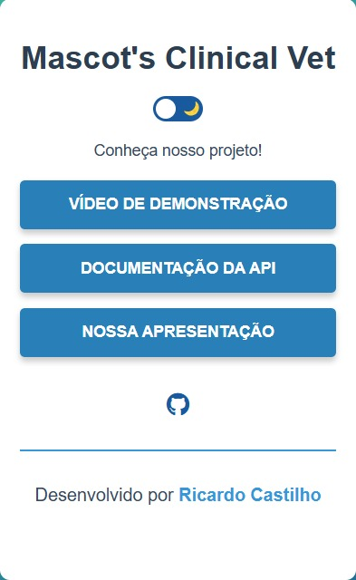
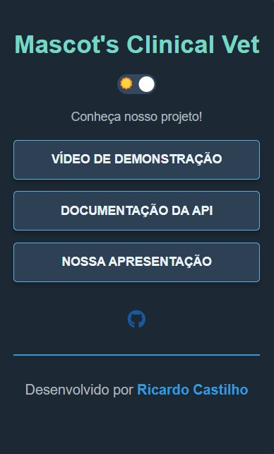

# Panfleto Digital - API: Mascot's Clinical Vet

Este projeto tem como objetivo a criação de um panfleto digital interativo, utilizado para apresentar informações sobre a Mascot's Clinical Vet, incluindo links úteis, como demonstração do projeto, documentação e a apresentação do trabalho. O panfleto conta com design responsivo, modo claro e escuro (dark mode) e é desenvolvido com HTML, CSS e JavaScript.

## Tecnologias Utilizadas

- **HTML**: Para estruturação do conteúdo da página.
- **CSS**: Para estilização do layout, incluindo tema claro e escuro (dark mode).
- **JavaScript**: Para funcionalidades interativas, como a troca de tema e manipulação de eventos.
- **FontAwesome**: Para adicionar ícones sociais (GitHub).

## Funcionalidades

- **Modo Claro e Escuro**: Alternância de temas para melhorar a experiência do usuário.
- **Links Interativos**: Com acesso à demonstração do projeto, documentação e apresentação.
- **Informações do Desenvolvedor**: Sinalização de autoria com link para o GitHub do desenvolvedor.

## Design

<div style="display: flex; justify-content: space-around; align-items: center;">
    <div style="text-align: center;">
        <strong>White Mode</strong><br>
        
    </div>
    <div style="text-align: center;">
        <strong>Dark Mode</strong><br>
        
    </div>
</div>


## Como Rodar o Projeto

1. Clone o repositório:

```bash
git clone https://github.com/seu-usuario/panfleto-digital.git
```
2. Navegue até o diretório do projeto:

```bash
cd panfleto-digital
```
3. Abra o arquivo index.html em seu navegador preferido para visualizar o panfleto.

## Estrutura do Projeto
```bash
/panfleto-digital
|-- /images           # Imagens usadas no panfleto
|-- /styles.css       # Arquivo de estilos (CSS)
|-- /script.js        # Arquivo de interatividade (JavaScript)
|-- /index.html       # Arquivo principal da página
```

## Links Importantes

- [Projeto no GitHub Pages](https://ricardovcastilho.github.io/CLINICA-PRESENTATION-FLYER/)
- [Repositório no GitHub](https://github.com/RicardoVCastilho/CLINICA-PRESENTATION-FLYER)

## Autoria
Este projeto foi desenvolvido por [Ricardo Vitor Castilho](https://www.linkedin.com/in/ricardo-vitor-castilho-b60039241/).

## Licença
Este projeto é de código aberto e está sob a Licença MIT.

